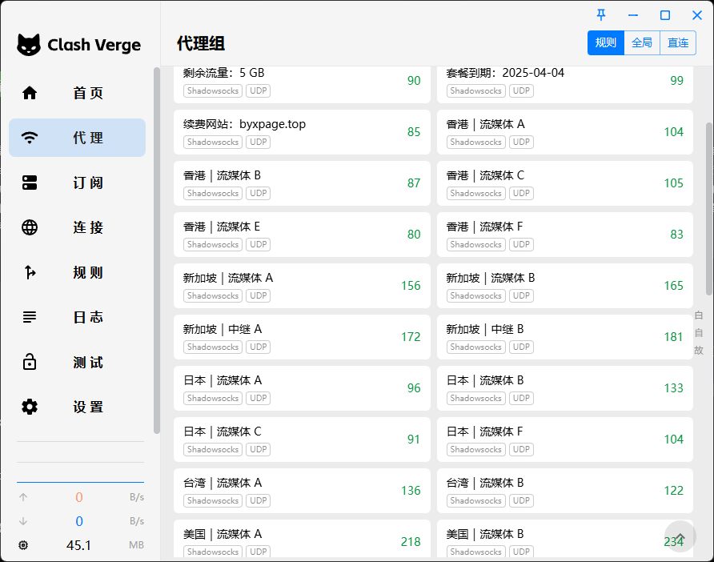

# 白羊星 - *高速稳定的VPN服务，解锁全球内容*

## 白羊星介绍
白羊星VPN，助您畅游全球网络，稳定高速，无惧限制！

### 白羊星介绍
白羊星机场怎么样？白羊星由马来西亚技术团队研发，专注于提供高速、安全、稳定的VPN服务。无论您是剧迷、游戏玩家还是远程办公人士，白羊星都能满足您的需求，助您畅享全球互联网。

## 白羊星协议
使用白羊星匿名上网服务，即表示您已理解、接受并同意以下使用条款：

- 禁止非法入侵、端口扫描或攻击任何计算机、设备、服务器或网络。
- 禁止散布病毒、木马、蠕虫及其他恶意软件。
- 禁止宣扬或怂恿犯罪及恐怖活动。
- 禁止交易、销售或散布非法资料，如儿童色情内容。
- 禁止发送垃圾邮件、恐吓邮件或诈骗信息。

如用户违反上述规定，我们有权终止账号，恕不另行通知或退款。建议勿与他人共享账号，但可在多台设备上使用。

### 白羊星机场测速

## 如何注册并选择套餐
注册白羊星VPN非常简单：

1. 访问白羊星官网并注册账户。
2. 选择适合您的套餐，并完成支付。
3. 下载并安装白羊星VPN客户端。
4. 登录您的账户，即可开始畅游全球网络！

## 套餐详情
| 套餐 | 价格 | 流量 | 设备支持 | 特点 |
|------|------|------|------|------|
| **基础配置** | **¥12.00/月** | 100GB/月 | 5 台 | 适合白领，支持全球流媒体 |
| **中级配置** | ¥25.00/月 | 300GB/月 | 8 台 | 适合电影爱好者 |
| **高级配置** | ¥48.00/月 | 800GB/月 | 10 台 | 适合创作者与搬运 |
| **白羊专属** | ¥188.00/年 | 230GB/月 | 不限 | 不限设备，适合电影用户 |
| **国际企业专线** | ¥500.00/月 | 深港IPLC | 不限 | 企业级网络，支持全球业务 |

## 常见问题（FAQ）

### 白羊星支持哪些设备？
白羊星支持 Windows、macOS、iOS、Android 及路由器等多种设备。

### 如何免费试用白羊星？
注册账户后可享受 **24小时免费试用**，流量限额 **5GB**。

### 白羊星支持哪些流媒体？
支持 **Netflix、Hulu、HBO、Disney+、ChatGPT** 等流媒体解锁。

> **白羊星** - 高速稳定的VPN服务，解锁全球内容：[访问官网订阅](https://jump.p6p.net/306)
